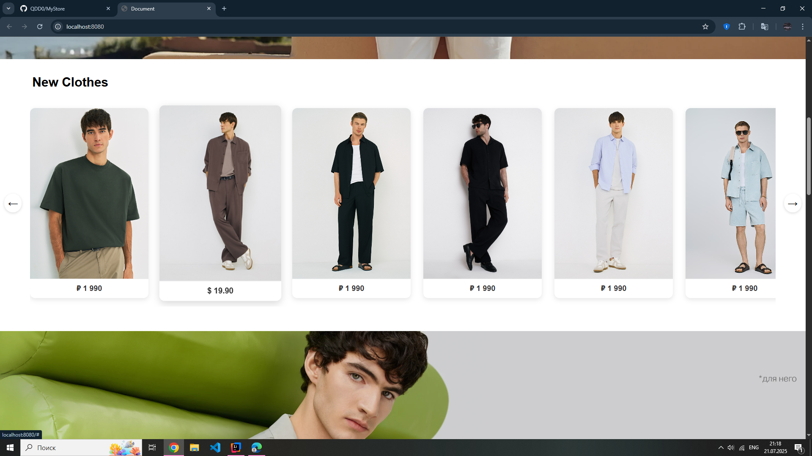
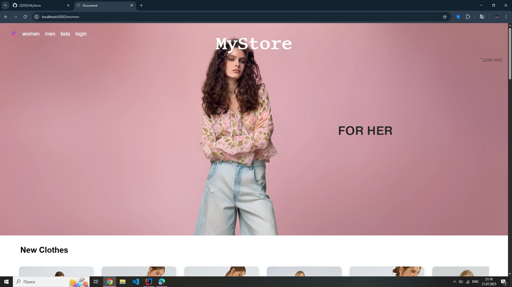
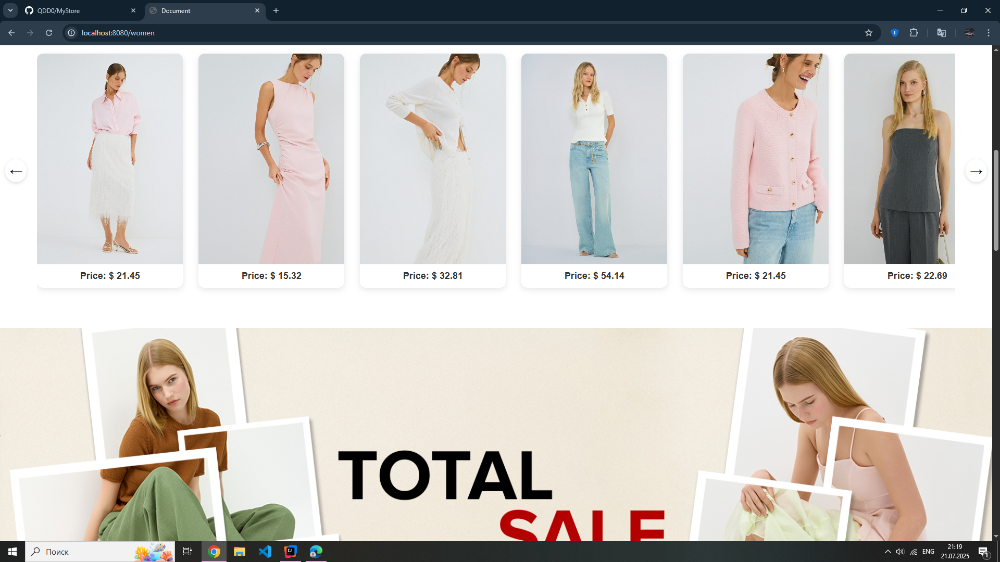
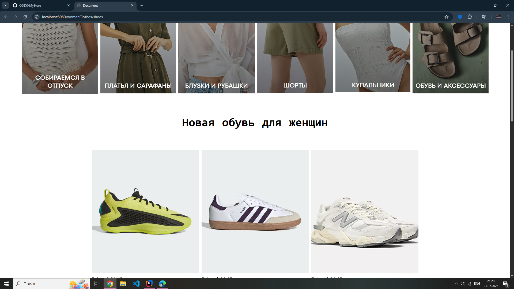
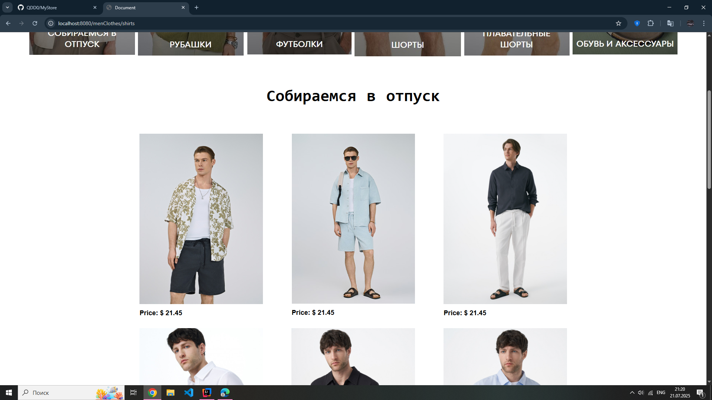

# MyStore — учебное веб‑приложение (Spring Boot + Thymeleaf)

Классическое сервер‑рендерное приложение интернет‑витрины с авторизацией и регистрацией. Построено на Spring Boot 3, использует Thymeleaf для шаблонов, Spring Security для аутентификации и Spring Data JPA с базой H2 (in‑memory) для хранения пользователей.

## Стек
- **Java 17**
- **Spring Boot 3.5.3**
  - spring-boot-starter-web (MVC)
  - spring-boot-starter-thymeleaf (шаблоны)
  - spring-boot-starter-security (аутентификация)
  - spring-boot-starter-data-jpa (доступ к БД)
- **H2 Database** (in‑memory, консоль `/h2-console`)
- **Lombok**
- **Maven** (mvnw wrapper в репозитории)

## Возможности
- Публичные разделы каталога: `/`, `/men`, `/women`, `/kids`
- Тематические страницы: `/womenClothes/*`, `/menClothes/*`
- Регистрация: `GET /register`, `POST /register`
- Вход/выход: `GET /login`, logout по умолчанию, редирект на `/login?logout`
- Консоль H2: `/h2-console` (включена в dev‑режиме)

## Быстрый старт
### Требования
- JDK 17+
- Интернет для загрузки Maven‑зависимостей (первый запуск)

### Запуск (вариант 1 — через Maven Wrapper)
```bash
./mvnw spring-boot:run
```
Windows:
```bat
mvnw.cmd spring-boot:run
```
Приложение поднимется на `http://localhost:8080`.

### Сборка jar и запуск (вариант 2)
```bash
./mvnw clean package -DskipTests
java -jar target/MyStore-0.0.1-SNAPSHOT.jar
```

### Тесты
```bash
./mvnw test
```

## Доступ по умолчанию
При первом запуске автоматически создаётся администратор:
- **Логин**: `admin`
- **Пароль**: `admin`
Пароль сразу шифруется BCrypt и сохраняется в H2 (см. `AdminInitializer`).

H2 Console доступна на `http://localhost:8080/h2-console`.
- JDBC URL: `jdbc:h2:mem:testdb`
- User: `sa`
- Password: пусто

## Основные маршруты
- `/`, `/men`, `/women`, `/kids` — основные страницы
- `/womenClothes/dresses|shirts|shorts|swimsuits|shoes|vacation`
- `/menClothes/t-shirts|shirts|shorts|swimshorts|shoes|vacation`
- `/continue` — служебная страница
- `/login`, `/register` — аутентификация/регистрация
- `/h2-console` — консоль БД (для разработки)

## Конфигурация
Файл: `src/main/resources/application.properties`
- H2 in‑memory: `spring.datasource.url=jdbc:h2:mem:testdb`
- Консоль H2: `spring.h2.console.enabled=true`, путь `/h2-console`
- JPA: `spring.jpa.hibernate.ddl-auto=update`
- Thymeleaf: `spring.thymeleaf.prefix=classpath:/templates/`, `spring.thymeleaf.suffix=.html`

Переключение на файл‑БД H2 (персистентно):
```properties
spring.datasource.url=jdbc:h2:file:./data/mystore;AUTO_SERVER=TRUE
```
В продакшене рекомендуется использовать полноценную СУБД (PostgreSQL/MySQL) и отключить `/h2-console`.

## Безопасность
Определена через `SecurityFilterChain`:
- Публичный доступ к статике и публичным страницам
- Форма логина на `/login`, успешный вход — редирект на `/`
- BCrypt для паролей (`PasswordEncoder`)
- CSRF для `/h2-console` отключён, `X-Frame-Options` для H2 снят (только для разработки)

Важно: учётная запись `admin/admin` предназначена для локальной разработки. Поменяйте пароль и отключите автосоздание в продакшене.

## Архитектура и структура проекта
```
src/
  main/
    java/org/example/mystore/
      MyStoreApplication.java          # Точка входа
      UsersService.java                # UserDetailsService (загрузка пользователей)
      controllers/
        HomeController.java            # Маршруты страниц каталога
        AuthController.java            # Логин/регистрация
      enity/
        Users.java                     # JPA-сущность пользователя
        AdminInitializer.java          # Создание admin при старте
      repository/
        UserRepository.java            # Spring Data JPA репозиторий
      security/
        SecurityConfig.java            # Конфигурация Spring Security
    resources/
      application.properties
      templates/                       # Thymeleaf шаблоны (auth, menClothes, womenClothes, ...)
      static/                          # CSS/JS/изображения
  test/
    java/org/example/mystore/
      MyStoreApplicationTests.java
```

## Скриншоты
Ниже — превью экранов (см. файлы в корне репозитория):










## Лицензия
Не указана. Если планируете распространять код — добавьте файл `LICENSE`.